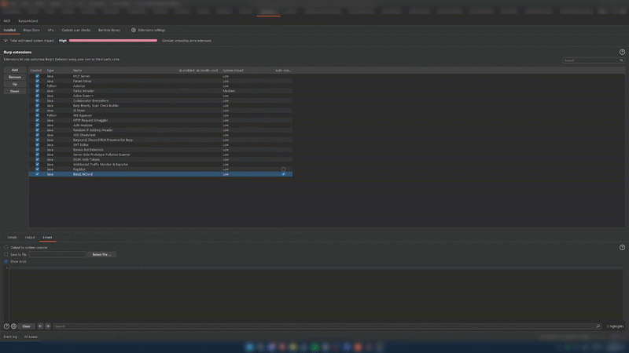
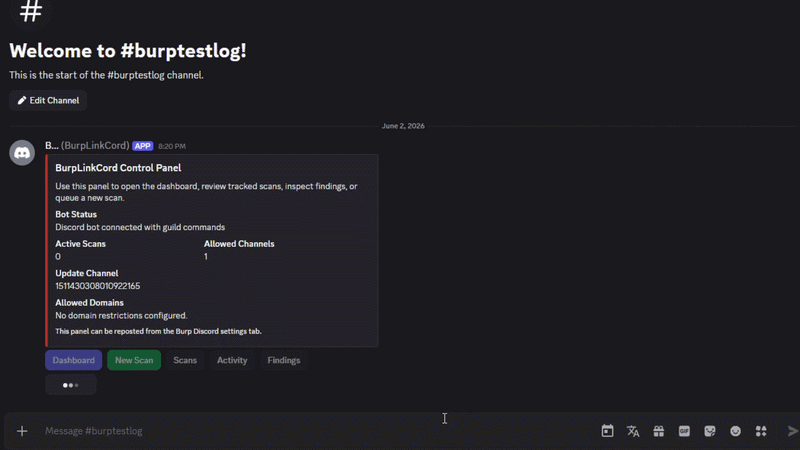
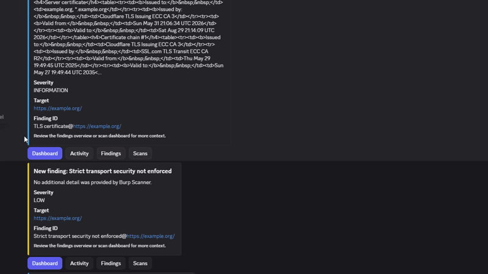

<div align="center">

# BurpLinkCord

**Burp Suite Professional extension with an embedded Discord bot.**  
Control scans, receive findings, and manage your testing session — without leaving Discord.

<br>

[](LICENSE)
[](https://adoptium.net/)
[](https://portswigger.net/burp)
[](https://discord.com/developers/applications)
[](https://github.com/discord-jda/JDA)

</div>

---

## Burp Suite Tab



---

## Discord Integration

<table>
<tr>
<td width="50%">



</td>
<td width="50%">



</td>
</tr>
</table>

---

## Features

| | |
|---|---|
| **Discord bot** | Slash commands, interactive buttons, and modals for full scan control |
| **Live notifications** | Scan lifecycle updates and findings sent to a dedicated update channel |
| **Control panel** | Persistent Discord embed with action buttons — repost any time |
| **Local REST API** | `localhost` control surface for scripting and CI integration |
| **Burp-native UI** | Dark-themed tab for status, settings, queue management, and activity |
| **Access control** | User whitelist, guild whitelist, channel whitelist, API shared secret |
| **Persistent settings** | All configuration survives extension reloads via Burp's persistence API |

---

## Requirements

| | |
|---|---|
| Java | 21+ |
| Burp Suite | Professional (Montoya API) |
| Discord | Bot application with Message Content Intent |

---

## Installation

**Option A — Download**

Grab the latest JAR from [Releases](https://github.com/N0tMaggi/BurpLinkCord/releases).

**Option B — Build from source**

```bash
git clone https://github.com/N0tMaggi/BurpLinkCord.git
cd BurpLinkCord
./gradlew shadowJar        # Linux / macOS
.\gradlew.bat shadowJar    # Windows
```

Output: `build/libs/BurpLinkCord-<version>.jar`

**Load in Burp Suite**

1. Extensions → Installed → Add
2. Extension type: `Java`
3. Select the JAR from `build/libs/`
4. The **BurpLinkCord** tab appears on load

---

## Discord Bot Setup

### 1 — Create a Discord application

1. Open the [Discord Developer Portal](https://discord.com/developers/applications) and create a new application.
2. Navigate to **Bot** → enable **Message Content Intent**.
3. Copy the bot token.

### 2 — Invite the bot

OAuth2 URL Generator — required scopes and permissions:

- **Scopes:** `bot`, `applications.commands`
- **Permissions:** `Send Messages`, `Embed Links`, `Use Slash Commands`, `Read Message History`

### 3 — Configure BurpLinkCord

Open the **Discord** tab in Burp and fill in:

| Field | Description |
|---|---|
| Enable Discord integration | Master toggle |
| Autostart on load | Auto-connect when the extension loads |
| Whitelisted Guild ID | Your server ID (right-click server → Copy ID) |
| Update / Log Channel ID | Channel for scan and findings notifications |
| Bot Token | From the Developer Portal — never share this |
| Local API Shared Secret | Used to authenticate local API calls |

Set **Whitelisted Discord IDs** (one user ID per line) and **Allowed Discord Channel IDs**, then click **Save Settings** → **Start Bot**.

### 4 — Publish the control panel

Click **Publish Control Panel** in the Discord tab to post the interactive embed with action buttons to your channel. Re-publish any time.

---

## Discord Commands

| Command | Description |
|---|---|
| `/dashboard` | Full interactive dashboard |
| `/status` | Extension and bot runtime status |
| `/scans` | Tracked scans with per-row controls |
| `/findings` | Findings from the current session |
| `/activity` | Recent runtime events |
| `/targeting` | Configured domains, profile, configuration |
| `/startscan` | Start a scan — `target`, optional `profile`, `configuration`, `crawl`, `audit` |
| `/pausescan` | Pause a running scan by ID |
| `/resumescan` | Resume a paused or stopped scan by ID |
| `/stopscan` | Stop an active scan by ID |
| `/deletescan` | Remove a scan from the queue by ID |

---

## Local REST API

Listens on `http://localhost:8765`. All endpoints require the `X-Api-Secret` header.

| Method | Path | Description |
|---|---|---|
| `GET` | `/health` | Extension health and status |
| `GET` | `/scans` | List tracked scans |
| `POST` | `/scans/start` | Start a new scan |
| `POST` | `/scans/{id}/pause` | Pause a scan |
| `POST` | `/scans/{id}/resume` | Resume a scan |
| `POST` | `/scans/{id}/stop` | Stop a scan |
| `DELETE` | `/scans/{id}` | Delete a scan |
| `GET` | `/issues` | List findings |
| `GET` | `/discord` | Discord bot status |
| `POST` | `/discord/panel` | Publish the Discord control panel |

```bash
curl -H "X-Api-Secret: YOUR_SECRET" http://localhost:8765/health
```

---

## Architecture

```
External Clients ──► Local API ──► Access Validation ──► Application Services
                                                                │
Burp Suite UI   ──►  ──────────────────────────────►          ├── Domain Models
                                                                ├── Settings Store
Discord Bot (JDA) ──────────────────────────────────►          ├── Event Bus
                                                                └── Burp Adapters ──► Montoya API
```

| Package | Responsibility |
|---|---|
| `bootstrap` | Dependency wiring and application assembly |
| `burp` | Montoya entrypoint, lifecycle, and Burp-facing adapters |
| `api` | Embedded HTTP server, routing, response serialization |
| `config` | Bootstrap configuration and persisted runtime settings |
| `security` | Authentication, authorization, request validation |
| `events` | Internal event bus for decoupled notifications |
| `domain` | Service abstractions and models for scans, findings, status |
| `ui` | Dark-themed Burp-native control tab |
| `discord` | JDA bot runtime, slash commands, embeds, buttons, modals |
| `logging` | Audit logging |
| `exception` | Application-specific exception hierarchy |

---

## Settings Reference

| Setting | Type | Description |
|---|---|---|
| `discordIntegrationEnabled` | boolean | Master toggle |
| `autostartEnabled` | boolean | Auto-connect on load |
| `discordGuildId` | string | Restricts commands to one server |
| `discordUpdateChannelId` | string | Dedicated notification channel |
| `whitelistedDiscordIds` | list | Allowed Discord user IDs |
| `allowedDiscordChannelIds` | list | Channels where commands are accepted |
| `allowedDomains` | list | Scan target domain whitelist; empty = unrestricted |
| `defaultScanProfile` | string | Profile name passed to Burp Scanner |
| `defaultScanConfiguration` | string | Scan configuration name |

---

## Security

- Never commit your bot token, Discord IDs, or API secret.
- The local API binds to `localhost` only — do not expose it externally.
- Every Discord interaction is validated against the user whitelist, guild, and channel before any action runs.

---

## License

Released under the [MIT License](LICENSE).

---

> **Note:** Parts of this documentation and codebase were drafted and refined with AI assistance. All technical content has been reviewed by the project author.
