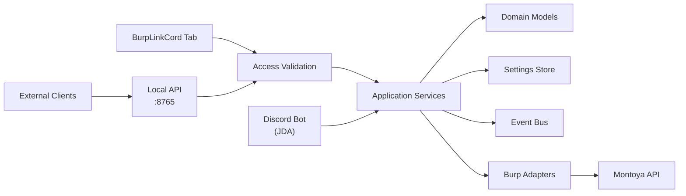

# BurpLinkCord

> **AI disclaimer:** Parts of this documentation were drafted and refined with AI assistance. All technical content has been reviewed and verified by the project author.

A Burp Suite Professional extension that embeds a Discord bot directly into your scanning workflow. Control scans, receive findings, and manage your Burp session from Discord — without leaving the channel.

---

<!-- SCREENSHOT PLACEHOLDER
Replace with an actual screenshot of the Burp Suite tab:

-->

<!-- VIDEO PLACEHOLDER
Replace with a demo video or GIF showing the Discord integration in action:
[](https://your-video-link-here)
-->

---

## Features

- **Discord bot integration** — slash commands, interactive buttons, and modals for full scan control from Discord
- **Live scan notifications** — scan start, status changes, and findings sent to a configurable update channel
- **Control panel message** — a persistent Discord embed with action buttons; repost any time from the Burp tab
- **Local REST API** — headless control surface on `localhost` for scripting and CI integration
- **Burp-native UI tab** — dark-themed status, settings, queue management, and activity log inside Burp Suite
- **Secure access control** — whitelist Discord user IDs, guild IDs, and channel IDs; shared secret for the local API
- **Settings persistence** — all configuration survives extension reloads via Burp's persistence API

---

## Requirements

| Requirement | Version |
|---|---|
| Java | 21+ |
| Burp Suite Professional | Any recent version (Montoya API) |
| Discord bot token | — |

---

## Build

```powershell
# Run tests
.\gradlew.bat test

# Build the fat JAR
.\gradlew.bat shadowJar
```

The artifact is written to `build/libs/BurpLinkCord-0.1.0-SNAPSHOT.jar`.

---

## Installation

1. Build the JAR (see above) or download a release.
2. Open Burp Suite Professional → **Extensions** → **Installed** → **Add**.
3. Set **Extension type** to `Java` and select the JAR from `build/libs/`.
4. The **BurpLinkCord** tab appears automatically on successful load.

---

## Discord Bot Setup

### 1 — Create a Discord application

1. Go to the [Discord Developer Portal](https://discord.com/developers/applications).
2. Create a new application and navigate to **Bot**.
3. Enable the **Message Content Intent** under Privileged Gateway Intents.
4. Copy the bot token — you will need it in step 3.

### 2 — Invite the bot to your server

Use the OAuth2 URL generator with the following scopes and permissions:

- **Scopes:** `bot`, `applications.commands`
- **Bot permissions:** `Send Messages`, `Embed Links`, `Use Slash Commands`, `Read Message History`

### 3 — Configure BurpLinkCord

Open the **Discord** tab in BurpLinkCord and fill in the fields:

| Field | Description |
|---|---|
| Enable Discord integration | Master toggle — must be on for the bot to start |
| Autostart on load | Connects the bot automatically when the extension loads |
| Whitelisted Guild ID | Your Discord server ID (right-click server → Copy ID) |
| Update / Log Channel ID | Channel where scan and findings notifications are sent |
| Bot Token | The token from the Developer Portal (**never share this**) |
| Local API Shared Secret | A secret string for authenticating local API calls |

Save settings, then click **Start Bot**.

### 4 — Set up access control

In the **Access Control** section of the Discord tab:

- **Whitelisted Discord IDs** — one user snowflake ID per line; only these users can run commands
- **Allowed Discord Channel IDs** — one channel ID per line; commands are ignored outside these channels

### 5 — Publish the control panel

Click **Publish Control Panel** in the Discord tab (or call `POST /discord/panel` via the local API) to post a persistent embed with action buttons to the configured channel.

---

## Discord Commands

| Command | Description |
|---|---|
| `/dashboard` | Opens the full interactive dashboard |
| `/status` | Shows extension and bot runtime status |
| `/scans` | Lists tracked scans with controls per row |
| `/findings` | Lists findings collected during the session |
| `/activity` | Shows recent runtime events |
| `/targeting` | Shows configured domains, profile, and configuration |
| `/startscan` | Starts a scan with `target`, optional `profile`, `configuration`, `crawl`, `audit` |
| `/pausescan` | Pauses a running scan by ID |
| `/resumescan` | Resumes a paused or stopped scan by ID |
| `/stopscan` | Stops an active scan by ID |
| `/deletescan` | Removes a scan from the queue by ID |

---

## Local API

The extension listens on `http://localhost:8765` by default. All endpoints require the `X-Api-Secret` header matching the shared secret configured in the Discord tab.

| Method | Path | Description |
|---|---|---|
| `GET` | `/health` | Extension health and status |
| `GET` | `/scans` | List tracked scans |
| `POST` | `/scans/start` | Start a new scan |
| `POST` | `/scans/{id}/pause` | Pause a scan |
| `POST` | `/scans/{id}/resume` | Resume a scan |
| `POST` | `/scans/{id}/stop` | Stop a scan |
| `DELETE` | `/scans/{id}` | Delete a scan |
| `GET` | `/issues` | List findings |
| `GET` | `/discord` | Discord bot status |
| `POST` | `/discord/panel` | Publish the Discord control panel |

### Example

```bash
curl -s -H "X-Api-Secret: YOUR_SECRET" http://localhost:8765/health | jq
```

---

## Architecture



### Package overview

| Package | Responsibility |
|---|---|
| `bootstrap` | Dependency wiring and application assembly |
| `burp` | Montoya entrypoint, lifecycle, and Burp-facing adapters |
| `api` | Embedded HTTP server, routing, and response serialization |
| `config` | Bootstrap configuration and persisted runtime settings |
| `security` | Authentication, authorization, and request validation |
| `events` | Internal event bus for decoupled notifications |
| `domain` | Service abstractions and models for scans, findings, and status |
| `ui` | Burp-native dark-themed control tab |
| `discord` | JDA bot runtime, slash commands, embeds, buttons, modals |
| `logging` | Audit logging contract and implementation |
| `exception` | Application-specific exception hierarchy |

---

## Settings reference

All settings are saved via Burp's persistence API and survive extension reload.

| Setting | Type | Description |
|---|---|---|
| `discordIntegrationEnabled` | boolean | Master toggle for the Discord bot |
| `autostartEnabled` | boolean | Auto-connect on extension load |
| `discordGuildId` | string | Restricts commands to one server |
| `discordUpdateChannelId` | string | Dedicated notification channel; falls back to allowed channels |
| `whitelistedDiscordIds` | list | Allowed Discord user IDs |
| `allowedDiscordChannelIds` | list | Channels where commands are accepted |
| `allowedDomains` | list | Domain whitelist for scan targets; empty = unrestricted |
| `defaultScanProfile` | string | Profile name passed to Burp Scanner |
| `defaultScanConfiguration` | string | Scan configuration name |

---

## Development

```powershell
# Compile only
.\gradlew.bat classes

# Run tests
.\gradlew.bat test

# Full build (fat JAR)
.\gradlew.bat shadowJar

# Reload in Burp: Extensions → BurpLinkCord → Reload
```

After a rebuild, reload the extension in Burp — no restart required.

---

## CI / Releases

| Workflow | Trigger | What it does |
|---|---|---|
| **CI** | Push to `main`, any PR | Runs tests and builds the fat JAR; uploads a snapshot artifact (7-day retention) |
| **Release** | Push of a `v*` tag | Runs tests, builds the JAR with the tag version, creates a GitHub release with auto-generated notes and attaches the JAR |

To cut a release:

```bash
git tag v1.0.0
git push origin v1.0.0
```

Tags containing a `-` (e.g. `v1.0.0-beta`) are automatically marked as pre-releases.

---

## Roadmap

- [ ] Scan result diff notifications
- [ ] Multi-target queue support
- [ ] Discord OAuth-based user authentication
- [ ] Webhook-based CI/CD trigger support
- [ ] Configurable API port
- [ ] Extension settings export / import

---

## License

See [LICENSE](LICENSE) for details.

---

## Security

- **Never commit your bot token, Discord IDs, or API secret.** These are stored by Burp's persistence layer and never written to disk by BurpLinkCord itself.
- The local API binds to `localhost` only by default — do not expose it externally.
- Access control (user whitelist + channel whitelist) is enforced on every Discord interaction before any action is taken.
